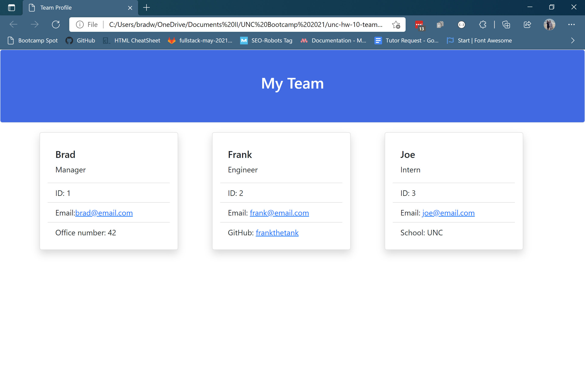

# Team Profile Generator

## An application using Node.js to create profiles for members of an office's team

## Table of Contents

- [Motivation and Technologies](#motivation)
- [Functionality](#functionality)
- [Challenges](#challenges)
- [Usage](#usage)

## Motivation

The goal of this application is to use Node.js, inquirer, and jest to create a webpage that displays the information about an office's team members. Inquirer is used to create prompts for the information for the profiles and jest tests the code to make sure that when information is inputed, it will work as intended.

#### Technologies

- HTML
- Bootstrap
- JavaScript
- Node.js
- Inquirer npm
- Jest npm

## Functionality

[Screen Capture Video Walkthrough](https://drive.google.com/file/d/1_Kh0WZCMLJ1YvwVkPi7kLEIz-kj4kcoL/view?usp=sharing)

### Screenshot of a webpage created with this application

- After installing inquirer and jest using 'npm install' in the command line, the user can then call the index.js JavaScript file using 'node index.js'
- The user can then follow the prompts created using inquirer to create the profiles of the team members
- Once the user is finished running through the prompts, an HTML file will be created that will display the information about the team members from their inputs

## Challenges

The major challenges I faced were overcoming some syntactical errors that were preventing my tests from running and preventing the HTML file from being generated correctly. Once those were overcome, the application ran smoothly

## Usage

- Create a simple webpage using prompts to show the information about the team members of an office

## Future Development

- Add comments to the JavaScript files
